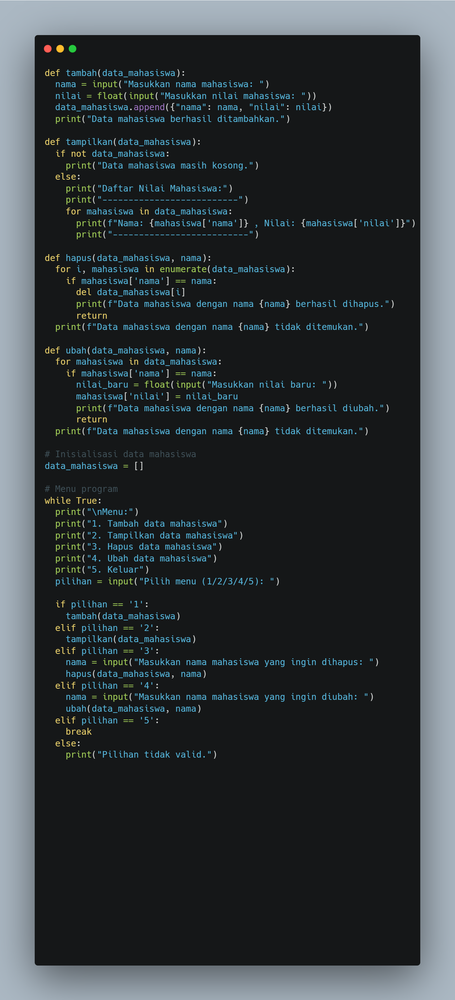
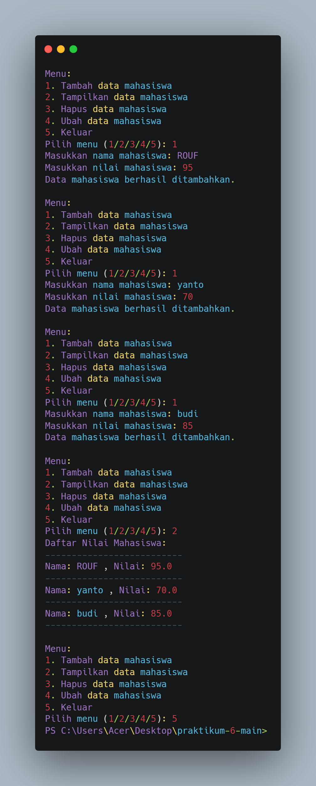

# praktikum-6
# DATA DIRI
Nama : RO'UF MUHAMMAD FAUZAN

Kelas : TI.24.AI

NIM : 312410157
# input dan output dari Praktikum 6
## Flowcart

## code

## Output

## Penjelasan 
- Fungsi ini digunakan untuk menambahkan data mahasiswa ke dalam daftar data_mahasiswa.
Di dalam fungsi ini, program meminta pengguna untuk memasukkan nama mahasiswa dan nilai mereka menggunakan input().
Nilai yang dimasukkan oleh pengguna diubah menjadi tipe data float untuk memastikan nilai berupa angka desimal.
Data mahasiswa kemudian ditambahkan ke dalam list data_mahasiswa dalam bentuk dictionary dengan key 'nama' dan 'nilai'.
Setelah data berhasil ditambahkan, akan ada pesan konfirmasi yang muncul.
Fungsi tampilkan(data_mahasiswa)
- Fungsi ini digunakan untuk menampilkan daftar mahasiswa yang ada dalam list data_mahasiswa.
Program memeriksa apakah list data_mahasiswa kosong atau tidak. Jika kosong, akan muncul pesan "Data mahasiswa masih kosong."
Jika ada data, maka program akan menampilkan setiap nama mahasiswa dan nilai mereka dalam format yang rapi.
Fungsi hapus(data_mahasiswa, nama)
- Fungsi ini digunakan untuk menghapus data mahasiswa berdasarkan nama yang dimasukkan oleh pengguna.
Program akan mencari mahasiswa berdasarkan nama di dalam list data_mahasiswa. Jika ditemukan, data mahasiswa tersebut akan dihapus menggunakan del.
Jika mahasiswa dengan nama yang dimaksud ditemukan, maka akan muncul pesan konfirmasi penghapusan.
Jika tidak ditemukan, akan muncul pesan bahwa mahasiswa dengan nama tersebut tidak ada dalam daftar.
- Fungsi ubah(data_mahasiswa, nama)
- Fungsi ini digunakan untuk mengubah nilai mahasiswa berdasarkan nama yang dimasukkan oleh pengguna.
Program akan mencari mahasiswa dengan nama yang sesuai dalam list data_mahasiswa.
List kosong data_mahasiswa diinisialisasi untuk menyimpan data mahasiswa.
Menu Program
Program akan menampilkan menu dengan pilihan:
Menambah data mahasiswa (1)
Menampilkan data mahasiswa (2)
Menghapus data mahasiswa berdasarkan nama (3)
Mengubah nilai mahasiswa berdasarkan nama (4)
Keluar dari program (5)
Program akan terus berjalan di dalam loop while True, menunggu input pilihan dari pengguna.
Berdasarkan input pengguna (pilihan), program akan mengeksekusi fungsi yang sesuai (misalnya, tambah, tampilkan, hapus, atau ubah).
Jika pengguna memilih pilihan yang tidak valid, maka program akan menampilkan pesan "Pilihan tidak valid."
## Cara Kerja Program
1.tambah data mahasiswa: Pengguna dapat menambahkan nama dan nilai mahasiswa ke dalam list.

2.Tampilkan data mahasiswa: Menampilkan semua data mahasiswa yang sudah dimasukkan.

3.Hapus data mahasiswa: Menghapus data mahasiswa berdasarkan nama yang dimasukkan.

4.Ubah data mahasiswa: Mengubah nilai mahasiswa berdasarkan nama yang dimasukkan.

5.Keluar: Program berhenti dengan memilih pilihan 5.
